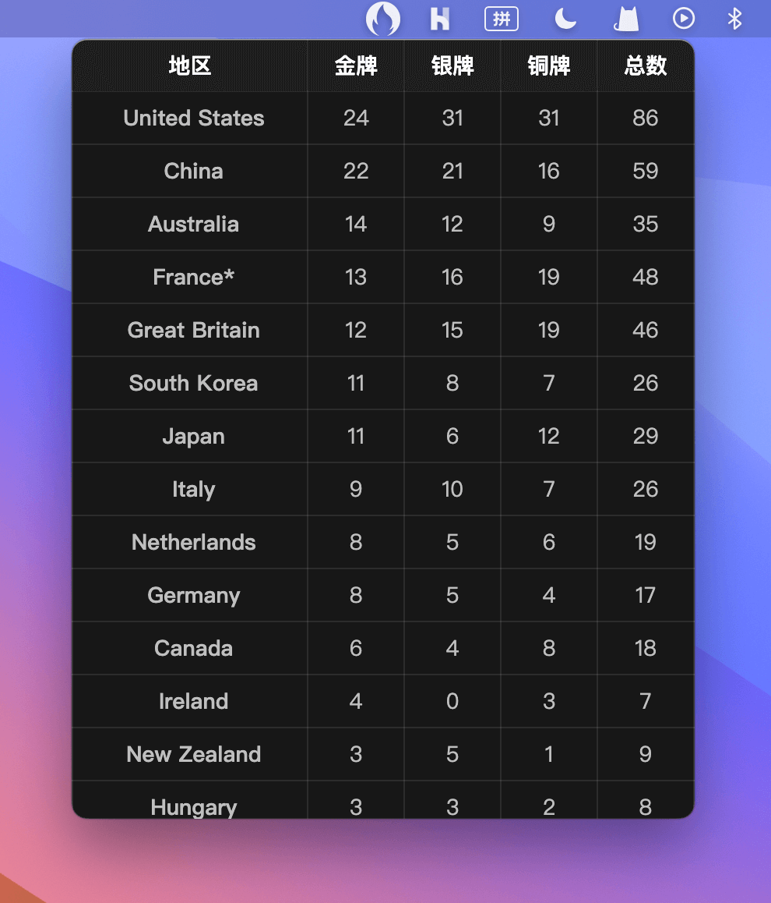

# 奥运奖牌榜



一个奥运奖牌榜菜单栏小工具，使用 [NativePHP](https://nativephp.com/) 开发，数据来自维基百科。

## 本地开发

这是一个 Laravel 项目，用常规的方法初始化项目，如：

```bash
# 安装依赖
composer install

# 复制 .env 文件
cp .env.example .env

# 生成 APP_KEY
php artisan key:generate
```

然后，还需要初始化 NativePHP：

```bash
# 安装 NativePHP
php artisan native:install

# 开启开发服务器
php artisan native:serve
```

## 打包成 App

```bash
# 因为这里用到了 Vite，首先需要构建下前端
npm run build

# 打包成 App
php artisan native:build
# 或者跳过问题，直接打包，以 macOS arm64 为例
# php artisan native:build -- mac arm64
```

打包体积大概 300MB，运行内存大概 60MB。
